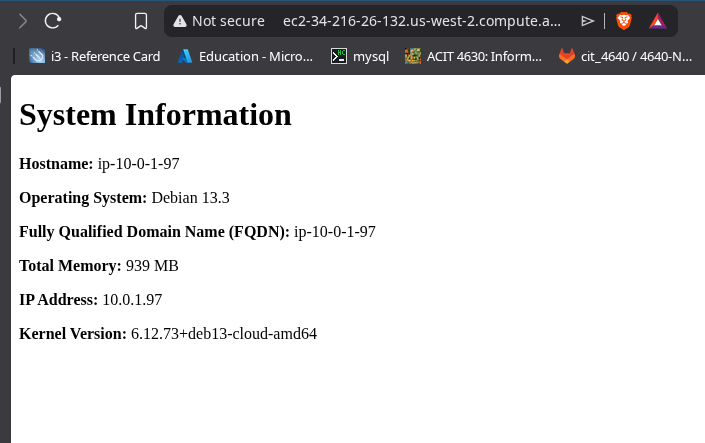

# Required commands

## Creating new keys 
1. `ssh key-gen -t ed25519 -f ~/.ssh/aws/aws -C "ssh key "` - creating ssh key 

## Terraform Commands 
1. `terraform init` - initializes working directory  
4. `terraform plan` - creates a plan to preview changes
5. `terraform apply` - applies the changes 
6. `terraform destroy` - destroys directory containing the configuration files 

## Ansible Commands
1. `sudo apt install yamllint` - installs package to checks yaml files 
2. `ansible-playbook --syntax-check webservers.yml` - validates ansible playbook
3. `ansible-playbook playbook.yml` - runs the playbook

## Screenshot
